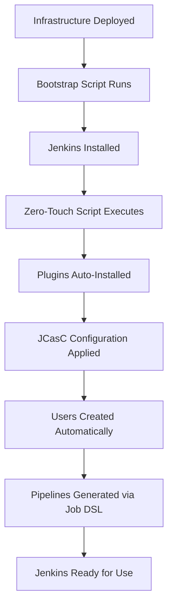

# Zero-Touch Jenkins Setup

This directory contains a complete **Zero-Touch Jenkins** implementation using modern DevOps practices. Jenkins starts in a fully configured, production-ready state without any manual setup steps.

## 🚀 What is Zero-Touch Setup?

Zero-Touch setup means Jenkins is completely automated:
- ✅ **No Setup Wizard** - Direct access to a fully configured instance
- ✅ **Pre-configured Users** - Admin and developer users ready to use
- ✅ **Auto-installed Plugins** - All essential plugins installed automatically
- ✅ **Automated Pipelines** - CI/CD pipelines created on startup
- ✅ **Configuration as Code** - All settings defined in YAML files
- ✅ **Modern UI** - Blue Ocean interface enabled by default

## 📁 Directory Structure

```
jenkins/
├── jenkins-config/
│   ├── casc.yaml              # Main JCasC configuration
│   ├── plugins.txt            # Plugin list for automation
│   ├── jenkins.yaml           # Legacy JCasC (kept for reference)
│   └── init.groovy.d/         # Initialization scripts
├── zero-touch-setup.sh       # Main automation script
├── ZERO_TOUCH_SETUP.md       # This documentation
└── AUTOMATED_SETUP.md        # Legacy setup documentation
```

## 🛠️ How It Works

### 1. Modern Architecture

The setup uses three key technologies:

- **Jenkins Configuration as Code (JCasC)** - YAML-based configuration
- **Job DSL Plugin** - Automated pipeline creation
- **Plugin Installation Manager** - Automated plugin installation

### 2. Implementation Flow



## 🔧 Configuration Files

### `casc.yaml` - Main Configuration

This file defines everything:
- User accounts and passwords
- Security settings and roles
- Tool configurations (Git, Node.js, Docker)
- Global settings and credentials
- **Automated pipeline creation via Job DSL**

### `plugins.txt` - Plugin List

Essential plugins for full DevOps functionality:
- Configuration as Code
- Job DSL
- Pipeline plugins
- Git integration
- Docker support
- Kubernetes integration
- Blue Ocean modern UI
- Security and role management

## 👥 Pre-configured Users

| Username  | Password | Role        | Permissions |
|-----------|----------|-------------|-------------|
| `admin`   | `admin123` | Administrator | Full access to everything |
| `developer` | `dev123` | Developer   | Build, deploy, view jobs |

## 🔧 Automated Pipelines

The setup automatically creates these pipelines:

### Main Pipelines
1. **Frontend Pipeline** - React/Node.js application
2. **Backend Pipeline** - Python/Flask API
3. **Infrastructure Pipeline** - Terraform deployment
4. **Data Structures Pipeline** - Microservices

### Organized Structure
- **AKS-Platform/** folder containing all project pipelines
- **Multi-branch Pipeline** for automatic branch detection
- **Pre-configured build steps** for each technology stack

## 🚀 Usage

### Quick Start

1. **Deploy Infrastructure:**
   ```bash
   cd aws-infrastrucutre-terraform
   ./setup.sh
   ```

2. **Run Zero-Touch Setup:**
   ```bash
   cd devops-infra/jenkins
   ./zero-touch-setup.sh
   ```

3. **Access Jenkins:**
   - URL: `http://YOUR_EC2_IP:8080/`
   - Login: `admin / admin123`
   - **No setup wizard required!**

### Manual Execution

If you want to run the zero-touch setup separately:

```bash
# Make executable
chmod +x devops-infra/jenkins/zero-touch-setup.sh

# Execute
./devops-infra/jenkins/zero-touch-setup.sh
```

## 🔒 Security Features

### Role-Based Access Control
- **Admin Role**: Full system administration
- **Developer Role**: Limited to job operations
- **Anonymous Access**: Completely disabled

### Environment Variables
All sensitive data uses environment variables:
```yaml
password: "${ADMIN_PASSWORD:-admin123}"
token: "${GITHUB_TOKEN:-default-token}"
```

## 🎨 Modern UI Features

### Blue Ocean Interface
- Modern, intuitive pipeline visualization
- Git integration with branch detection
- Visual pipeline editor
- Enhanced build logs and artifacts

### Themes and Customization
- Dark theme enabled by default
- Modern Jenkins appearance
- Customizable dashboard

## 🔧 Customization

### Adding New Users
Edit `casc.yaml`:
```yaml
securityRealm:
  local:
    users:
      - id: "newuser"
        password: "${NEW_USER_PASSWORD:-password123}"
```

### Adding New Pipelines
Add to the Job DSL section in `casc.yaml`:
```yaml
jobs:
  - script: >
      pipelineJob('my-new-pipeline') {
        definition {
          cpsScm {
            scm {
              git {
                remote { url('https://github.com/user/repo.git') }
                branches('*/main')
                scriptPath('Jenkinsfile')
              }
            }
          }
        }
      }
```

### Adding New Plugins
Add to `plugins.txt`:
```text
my-new-plugin:latest
another-plugin:1.2.3
```

## 🐛 Troubleshooting

### Jenkins Won't Start
```bash
# Check service status
ssh -i key.pem ubuntu@IP "sudo systemctl status jenkins"

# Check logs
ssh -i key.pem ubuntu@IP "sudo journalctl -u jenkins -f"
```

### JCasC Not Applied
```bash
# Verify configuration file
ssh -i key.pem ubuntu@IP "sudo cat /var/lib/jenkins/casc_configs/jenkins.yaml"

# Check JCasC logs
# Go to Jenkins -> Manage Jenkins -> System Log -> Add Logger: io.jenkins.plugins.casc
```

### Plugins Not Installing
```bash
# Check plugin installation
ssh -i key.pem ubuntu@IP "sudo ls -la /var/lib/jenkins/plugins/"

# Manually install plugins
ssh -i key.pem ubuntu@IP "sudo java -jar /opt/jenkins-plugin-cli.jar --war /usr/share/java/jenkins.war --plugin-file /var/lib/jenkins/ref/plugins.txt"
```

## 🔄 Updates and Maintenance

### Updating Configuration
1. Modify `casc.yaml` or `plugins.txt`
2. Commit changes to repository
3. Re-run zero-touch setup script
4. Jenkins will reload configuration automatically

### Backup Strategy
```bash
# Backup Jenkins configuration
sudo tar -czf jenkins-backup.tar.gz /var/lib/jenkins/casc_configs/

# Backup jobs (though they're in code!)
sudo tar -czf jenkins-jobs-backup.tar.gz /var/lib/jenkins/jobs/
```

## 📊 Benefits Over Traditional Setup

| Traditional Jenkins | Zero-Touch Jenkins |
|--------------------|--------------------|
| Manual setup wizard | Automated configuration |
| Click-through plugin installation | Declarative plugin list |
| Manual user creation | YAML-defined users |
| Manual pipeline creation | Job DSL automation |
| Configuration drift | Configuration as Code |
| Difficult to replicate | Identical across environments |
| Backup complexity | Code-based configuration |

## 🎯 Best Practices

### Development Workflow
1. **Infrastructure as Code**: All Jenkins config in version control
2. **Environment Parity**: Same setup across dev/staging/prod
3. **Automated Testing**: Pipeline definitions tested as code
4. **Security First**: Environment variables for all secrets
5. **Documentation**: Self-documenting configuration files

### Production Considerations
1. **Change Admin Passwords**: Use strong, unique passwords
2. **Configure HTTPS**: Enable SSL/TLS certificates
3. **Backup Strategy**: Regular automated backups
4. **Monitoring**: Enable Jenkins monitoring and alerting
5. **Access Control**: Integrate with corporate authentication

## 📚 References

- [Jenkins Configuration as Code](https://github.com/jenkinsci/configuration-as-code-plugin)
- [Job DSL Plugin](https://github.com/jenkinsci/job-dsl-plugin)
- [Plugin Installation Manager](https://github.com/jenkinsci/plugin-installation-manager-tool)
- [Blue Ocean Documentation](https://www.jenkins.io/projects/blueocean/)

## 🤝 Contributing

To improve the zero-touch setup:

1. Update configuration files in `jenkins-config/`
2. Test changes with the setup script
3. Document new features in this README
4. Commit changes with descriptive messages

---

**🎉 Enjoy your Zero-Touch Jenkins setup! No more clicking through setup wizards!** 🚀